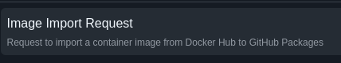

# LibertyHub

Repository to release images from Docker Hub and securely republish them within GitHub Packages in an auditable and reliable manner.

## Purpose

LibertyHub is designed to provide a transparent and secure way to import container images from external sources (initially Docker Hub) into GitHub Packages. This enhances security, provides audit trails, and reduces dependency on external registries.

## How It Works

1. **Issue-Based Workflow**: Users create an issue using a standardized template
2. **Automated Processing**: GitHub Workflows process the request
3. **Verification & Publishing**: The system checks if the image already exists, then imports and publishes it
4. **Audit Trail**: All actions are logged for complete transparency

## Features

- **Source Selection**: Choose the image source (initially Docker Hub, with plans to expand)
- **Support for Official Images**: Option to mark an image as an official Docker Hub image
- **Simple Request Process**: Easy-to-use issue template with dropdown options
- **Latest Version Support**: Option to select the latest version of an image
- **Automatic Updates**: For images marked as "latest", duplicate requests will trigger an update
- **Naming Convention**: Images are republished following the pattern `<source>-<image>:<version>`
- **Complete Audit Trail**: All actions are logged, including image hashes, versions, and workflow details
- **Duplicate Prevention**: System verifies if the requested image already exists before processing

## Usage

### Video

Click to watch the video instructions to new image import

<video width="100%" controls>
   <source src="/assets/new-image.webm" type="video/webm">
   Your browser does not support the video tag.
</video>

### Text

1. Create a new issue using the "Image Import Request" template
2. Fill in the required information:
   - Image source (select "Docker Hub" from dropdown)
   - Check "This is an official Docker Hub image" if applicable
   - Repository name (leave empty for official images, e.g., nginx, ubuntu)
   - Repository name (required for non-official images, e.g., bitnami)
   - Image name
   - Version (or check "Use latest")
3. Submit the issue
4. The workflow will process your request automatically and provide updates in the issue comments
5. Once completed, the image will be available in GitHub Packages with the naming convention `dockerhub-<image>:<version>`

### Keeping Latest Images Updated

To update an image tagged as "latest" to the newest version available:
1. Simply create a new image import request with the same image details
2. Check the "Use latest" option
3. Submit the issue
4. The system will detect it's a duplicate request for a "latest" image and automatically update it

## Audit Information

Each image import includes the following audit information:

- Original image source and URL
- Image hash before and after import
- Timestamp of import
- GitHub Actions workflow run ID and logs
- User who initiated the request

For updated "latest" images, additional audit information includes:
- Previous image digest
- New image digest
- Update timestamp
- User who initiated the update

## Contributing

Contributions to improve LibertyHub are welcome. Please see our contributing guidelines for more information.

## License

That code was generated with GitHub Copilot using Claude 3.7 Sonnet Model. The code is licensed under the MIT License.
